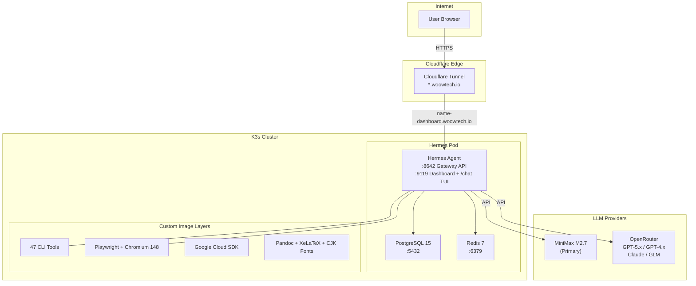
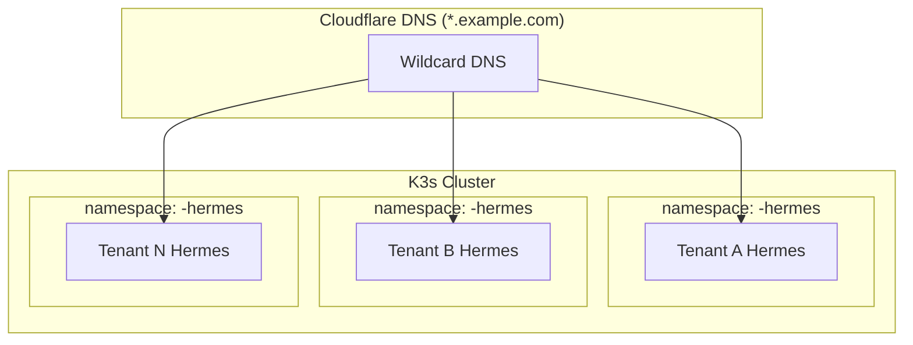
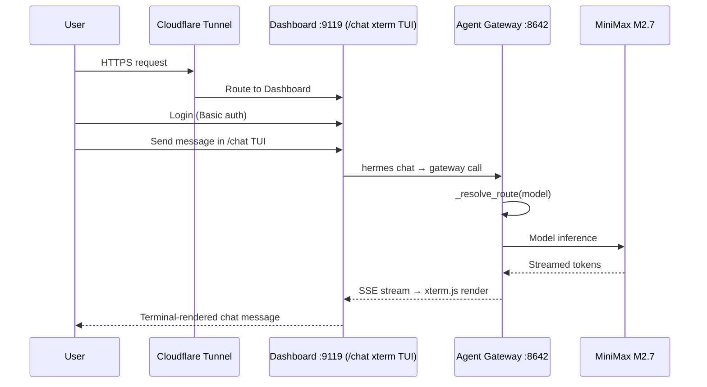
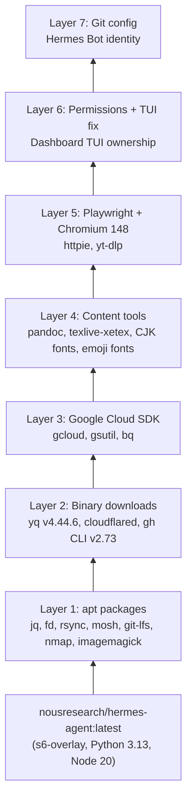
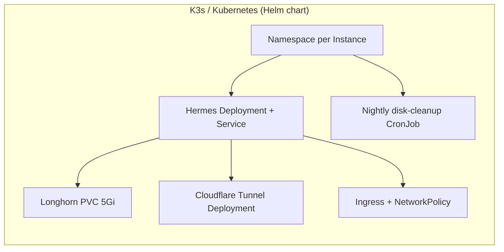

<div align="center">
  

  <h1>WoowTech Hermes Agent</h1>
  <p><strong>Enterprise AI Assistant — K8s Deployment</strong><br/><sub>Kubernetes manifests, deploy scripts, and configuration for production deployment on K3s</sub></p>

  <p>
    
    
    
    
    
    
    
  </p>

  <p>
    <a href="README.md">English</a> |
    <a href="README_zh-TW.md">繁體中文</a>
  </p>
</div>

> [!IMPORTANT]
> **This repository packages the Hermes Agent as a Helm chart for K3s / Kubernetes.**
>
> For single-node Podman deployment, see the sibling repository: [**WOOWTECH/Woow_podman_hermes**](https://github.com/WOOWTECH/Woow_podman_hermes).

---

## Table of Contents

- [Overview](#overview)
- [Key Features](#key-features)
- [Architecture](#architecture)
- [System Components](#system-components)
- [Service URLs](#service-urls)
- [MCP Integration](#mcp-integration)
- [Browser Terminal (ttyd)](#browser-terminal-ttyd)
- [Screenshots](#screenshots)
- [Deployment](#deployment)
- [Custom Docker Image](#custom-docker-image)
- [Multi-Instance Deployment](#multi-instance-deployment)
- [White-Label Branding](#white-label-branding)
- [CLI Tools Reference](#cli-tools-reference)
- [Skills Catalog](#skills-catalog)
- [API Reference](#api-reference)
- [Testing](#testing)
- [Security](#security)
- [Troubleshooting](#troubleshooting)
- [Changelog](#changelog)
- [Support & License](#support--license)

---

## Overview

**WoowTech Hermes Agent** is an enterprise-grade, self-hosted AI assistant platform built on [Nous Research Hermes Agent](https://github.com/NousResearch/hermes-agent). It provides a complete AI workspace with a single Dashboard TUI chat surface (xterm.js REPL of `hermes chat` inside the agent container), 47 pre-installed CLI tools, 93 AI skills, and multi-LLM support — all deployable on K3s Kubernetes with automated Cloudflare Tunnel HTTPS.

### Why WoowTech Hermes?

| Challenge | WoowTech Solution |
|-----------|-------------------|
| SaaS AI tools leak sensitive data | **Self-hosted** on your own infrastructure |
| One-size-fits-all AI assistants | **93 domain skills** including Odoo 18 ERP, ESG/WELL/LEED, finance |
| Single-model lock-in | **Multi-LLM**: MiniMax M2.7 primary + OpenAI/Claude/GLM via OpenRouter |
| No browser automation | **Playwright + Chromium 148** built into the agent container |
| Complex Kubernetes setup | **One-command deployment** with `helm install` + golden configs |
| Single-tenant only | **Multi-instance** with namespace isolation + per-tenant branding |

---

## Key Features

| Feature | Description |
|---------|-------------|
| **Dashboard + TUI Chat** | Dashboard (:9119) with 150+ settings + xterm.js REPL of `hermes chat` at `/chat` running inside the agent container |
| **47 CLI Tools** | curl, git, jq, yq, rg, fd, gcloud, gh, pandoc, ffmpeg, yt-dlp, nmap, and more |
| **93 AI Skills** | 19 categories: software-dev, creative, MLOps, Odoo ERP, research, media |
| **Multi-LLM** | MiniMax M2.7 (primary), GPT-5.x/4.x via OpenRouter, Claude, GLM |
| **Model Routing** | Gateway `model_routes` with `@openai:` and `@openai-api:` prefix support |
| **Playwright + Chromium** | Built-in browser automation for screenshots, form filling, E2E testing |
| **Persistent Memory** | SOUL.md (identity), USER.md (preferences), MEMORY.md (learned context) |
| **Kanban + Tasks** | Project boards, todo lists, cron job scheduling |
| **Insights Analytics** | Token usage, model distribution, cost tracking |
| **Gateway API** | OpenAI-compatible REST API on port 8642 |
| **White-Label Branding** | Custom logos, colors, titles per instance |
| **Cloudflare Tunnel** | Automatic HTTPS without port forwarding or certificates |

---

## Architecture

### System Architecture



### Multi-Instance Architecture



### Request Flow



### Docker Image Layers



### K3s Resource Overview



> Podman single-node deployment lives in the sibling repository [WOOWTECH/Woow_podman_hermes](https://github.com/WOOWTECH/Woow_podman_hermes).

---

## System Components

| Component | Image | Port | Purpose | Chart Template |
|-----------|-------|------|---------|----------------|
| **Hermes Agent** | `nousresearch/hermes-agent:latest` | 8642 (Gateway), 9119 (Dashboard + /chat TUI) | AI engine, tool execution, Gateway API, Dashboard with xterm.js chat TUI | `templates/hermes-deployment.yaml` |
| **Browser Terminal** | `ubuntu:24.04` + ttyd 1.7.7 | 7681 | Browser-based TUI — kubectl exec into hermes-agent shell | `templates/terminal.yaml` |
| **PostgreSQL** | `postgres:15` | 5432 | Data persistence (conversations, memory, settings) | `templates/postgresql-deployment.yaml` |
| **Redis** | `redis:7-alpine` | 6379 | Cache, session state | `templates/redis-deployment.yaml` |
| **Cloudflared** | `cloudflare/cloudflared:latest` | — | Cloudflare Tunnel for HTTPS access | `templates/cloudflared.yaml` |

### Chart Layout

```
.
├── Chart.yaml                              # apiVersion v2, name: hermes
├── values.yaml                             # All defaults + per-component switches
├── .helmignore
└── templates/
    ├── namespace.yaml                      # Guarded by namespace.create
    ├── rbac.yaml                           # SA + ClusterRole + Role
    ├── configmap.yaml                      # cf-config + hermes-config + toolset overrides
    ├── secret.yaml                         # hermes-secrets + cf-secrets (stringData)
    ├── pvc.yaml                            # 3 PVCs (agent / postgres / redis)
    ├── postgresql-deployment.yaml          # postgresql.enabled
    ├── redis-deployment.yaml               # redis.enabled
    ├── hermes-deployment.yaml              # Agent Deployment + Service (Gateway + Dashboard)
    ├── cloudflared.yaml                    # cloudflared.enabled
    ├── ingress.yaml                        # cloudflare.ingress.enabled
    ├── network-policy.yaml                 # networkPolicy.enabled
    ├── terminal.yaml                       # terminal.enabled (ttyd + SA/Role/RoleBinding)
    └── disk-cleanup-cronjob.yaml           # diskCleanup.enabled (nightly)
```

---

## Service URLs

The WoowTech Hermes deployment exposes two services via Cloudflare Tunnel:

| Service | URL | Port | Purpose |
|---------|-----|------|---------|
| **Dashboard** (Admin + Chat TUI) | `https://<PREFIX>-dashboard.woowtech.io` | 9119 | Agent management (config, MCP, models, logs, system) + xterm.js `hermes chat` REPL at `/chat` |
| **Terminal** (TUI) | `https://<PREFIX>-hermes-terminal.woowtech.io` | 7681 | Browser-based bash shell into hermes-agent container |

All services are protected by authentication:
- Dashboard: Username/Password (Basic provider)
- Terminal: HTTP Basic Auth (admin / configured password)

---

## MCP Integration

Hermes supports connecting to remote [Model Context Protocol (MCP)](https://modelcontextprotocol.io/) servers for extended tool capabilities.

### Configured MCP Servers

| Server | URL | Auth | Status |
|--------|-----|------|--------|
| Higgsfield | `https://mcp.higgsfield.ai/mcp` | OAuth 2.1 + PKCE | Authenticate via Dashboard |
| Browserless | `https://mcp.browserless.io/mcp` | Bearer Token | API key in headers |
| Cloudflare | `https://mcp.cloudflare.com/mcp` | OAuth 2.1 + PKCE | Authenticate via Dashboard |
| WoowTech Odoo | `https://woowtech-mcp-odoo.woowtech.io/...` | URL Token | Auto-connects |

### Dashboard MCP OAuth

For OAuth-based MCP servers (Higgsfield, Cloudflare), authentication is done directly from the Dashboard:

1. Go to **Dashboard → MCP** page
2. Click **🔑 Authenticate** on the server row
3. A popup opens to the OAuth provider's login page
4. After authorization, the callback returns to the Dashboard
5. Tokens are stored in `mcp-tokens/` and auto-refresh

**Requirements:**
- `HERMES_DASHBOARD_PUBLIC_URL` must be set to the Dashboard's public URL
- The callback path `/api/mcp/oauth/callback/*` must be publicly reachable

### MCP OAuth Patch

The Dashboard's React SPA shows the Authenticate button for all HTTP MCP servers via a runtime patch:

```bash
# Re-apply after pod restart
bash patches/mcp-oauth-all-http.sh [kubectl-context] [namespace]
```

This is also applied automatically via the agent container's `postStart` lifecycle hook.

---

## Browser Terminal (ttyd)

A browser-based terminal provides direct shell access into the hermes-agent container — the same environment where all 47 CLI tools, the Hermes CLI, and MCP servers run.

### Architecture

```
Browser → Cloudflare Tunnel → ttyd pod (:7681) → connect.sh → kubectl exec → hermes-agent bash
```

### Access

```
URL:  https://<PREFIX>-hermes-terminal.woowtech.io
Auth: HTTP Basic (admin / configured password)
```

### What's Available in the Terminal

- `hermes` CLI (version, config, mcp list/login, gateway, etc.)
- All 47 pre-installed CLI tools (git, jq, yq, gh, nmap, playwright, etc.)
- Python 3.13 + pip
- Direct access to `/opt/data/config.yaml` and `.hermes/` state directory
- Same PID namespace as the running Gateway and Dashboard processes

### Manifest

The terminal is deployed as a separate lightweight pod (`templates/terminal.yaml`, enabled by default via `terminal.enabled: true`):
- **Image**: `ubuntu:24.04` (ttyd + kubectl downloaded at startup)
- **Resources**: 50m CPU / 64Mi RAM (request), 200m CPU / 256Mi (limit)
- **RBAC**: Dedicated ServiceAccount with pods/get,list + pods/exec only
- Set `terminal.enabled: false` in `values.yaml` to skip.

---

## Screenshots

### Login Page


> Password-only login — no username required. Simple and secure for team access.

### Chat Interface


> Full-featured chat with markdown rendering, code highlighting, and streaming responses.

### AI Response


> AI responses support code blocks, tables, markdown formatting, and tool call results.

### Model Picker


> Switch between MiniMax M2.7, GPT-5.x, GPT-4.x, and other models in real-time.

### Skills Catalog


> 93 pre-loaded AI skills organized into 19 categories, from software development to Odoo ERP.

### Memory Management


> Persistent memory system: SOUL.md (identity), USER.md (preferences), MEMORY.md (learned context).

### Insights Analytics


> Track token usage, model distribution, conversation metrics, and cost analysis.

### Kanban Board


> Built-in Kanban boards for project management and task tracking.

### Tasks & Cron


> Schedule recurring tasks with cron expressions and monitor execution history.

### Dashboard (150+ Settings)


> Full control over agent behavior, LLM settings, MCP servers, toolsets, and more.

### Mobile Responsive


> Fully responsive design works on phones and tablets.

---

## Deployment

### Prerequisites

- K3s (or any Kubernetes 1.24+) cluster with `kubectl` access
- Helm 3.x
- Longhorn storage class for the agent PVC (or override `hermes.persistence.storageClassName`)
- `local-path` (or any RWO class) for PostgreSQL and Redis
- A Cloudflare account with a Tunnel token (if you want the built-in HTTPS ingress)

### Quick Start (Helm)

```bash
# 1. Clone this repo
git clone https://github.com/WOOWTECH/Woow_k3s_hermes.git
cd Woow_k3s_hermes

# 2. Create a values override with your secrets and domain
cat > my-values.yaml <<'EOF'
namespace:
  name: hermes

secrets:
  API_SERVER_KEY:     "<generate-a-strong-key>"
  MINIMAX_API_KEY:    "<your-minimax-key>"
  POSTGRES_PASSWORD:  "<pg-password>"
  TTYD_PASSWORD:      "<ttyd-basic-auth>"
  CF_API_TOKEN:       "<cloudflare-api-token>"
  CF_TUNNEL_TOKEN:    "<cloudflare-tunnel-token>"

cloudflare:
  domain: hermes.example.com
  ingress:
    enabled: true
    className: traefik
EOF

# 3. Install (creates the namespace + all resources)
helm install hermes . -n hermes --create-namespace -f my-values.yaml

# 4. Watch it come up
kubectl -n hermes get pods -w
```

### Feature Toggles (`values.yaml`)

Every component ships behind an `enabled` flag so you can strip the chart down for
dev clusters or turn everything on for a full production install.

| Toggle | Default | What it renders |
|--------|---------|-----------------|
| `namespace.create` | `true` | The `Namespace` object itself. |
| `postgresql.enabled` | `true` | PostgreSQL 15 Deployment + Service + PVC. |
| `redis.enabled` | `true` | Redis 7-alpine Deployment + Service + PVC. |
| `cloudflared.enabled` | `true` | Cloudflare Tunnel Deployment (needs `CF_TUNNEL_TOKEN`). |
| `cloudflare.ingress.enabled` | `true` | `Ingress` that routes `<domain>/api` to the gateway. |
| `terminal.enabled` | `true` | ttyd browser terminal (SA/Role/RoleBinding + Deployment + Service). |
| `diskCleanup.enabled` | `true` | Nightly CronJob that trims journals + dumps on the agent PVC. |
| `networkPolicy.enabled` | `true` | NetworkPolicies restricting DB/Redis to `hermes-agent` pods. |
| `hermes.service.nodePort` / `dashboardNodePort` | `null` | Only rendered when `hermes.service.type: NodePort`. |

### Preview / diff before applying

```bash
helm lint .
helm template hermes . -f my-values.yaml | less
helm diff upgrade hermes . -n hermes -f my-values.yaml   # if helm-diff plugin installed
```

### Golden Configuration (`config/golden-config.yaml`)

The golden config is the central configuration file for the Hermes Agent (630+ lines). Key sections:

| Section | Settings | Description |
|---------|----------|-------------|
| `platforms.api_server` | 28 model routes, CORS, API key | Gateway API configuration |
| `llm` | model, provider, temperature, max_tokens | LLM inference settings |
| `mcp.servers` | Playwright, filesystem, fetch | MCP server configuration |
| `agent` | approval_mode, tools, skills | Agent behavior settings |
| `dashboard` | auth, TUI, themes, plugins | Dashboard configuration |

### Model Routing

The Gateway routes model aliases to LLM providers via `model_routes`:

```yaml
model_routes:
  "@openai:gpt-5.4-mini":
    model: openai/gpt-5.4-mini
    base_url: https://openrouter.ai/api/v1
    api_key: __OPENROUTER_API_KEY__
  "@openai-api:gpt-5.4-mini":   # OpenAI-compatible client format
    model: openai/gpt-5.4-mini
    base_url: https://openrouter.ai/api/v1
    api_key: __OPENROUTER_API_KEY__
```

**Supported models** (11 models x 2 prefixes = 22 routes):
gpt-5.5, gpt-5.5-pro, gpt-5.4, gpt-5.4-mini, gpt-5.4-nano, gpt-5-mini, gpt-5.3-codex, gpt-5.2-codex, gpt-4.1, gpt-4o, gpt-4o-mini

### Environment Variables

| Variable | Required | Description |
|----------|----------|-------------|
| `MINIMAX_API_KEY` | Yes | MiniMax M2.7 API key |
| `OPENROUTER_API_KEY` | Yes | OpenRouter API key for GPT/Claude models |
| `API_SERVER_KEY` | Yes | Gateway API authentication key |
| `DASHBOARD_PASSWORD` | Yes | Dashboard Basic-auth password |
| `CLOUDFLARE_TUNNEL_TOKEN` | K3s only | Cloudflare Tunnel token |
| `POSTGRES_PASSWORD` | Yes | PostgreSQL password |

---

## Custom Docker Image

The custom Dockerfile (`docker/Dockerfile.hermes-agent`) extends the base image with 7 layers:

```bash
# Build custom image
cd docker
docker build -t hermes-agent-custom:latest -f Dockerfile.hermes-agent .

# Push to registry
docker tag hermes-agent-custom:latest <registry>/hermes-agent-custom:latest
docker push <registry>/hermes-agent-custom:latest
```

### What's Added vs Base Image

| Layer | Packages | Size Impact |
|-------|----------|-------------|
| Core apt | jq, fd, rsync, mosh, git-lfs, imagemagick, nmap, dnsutils | ~50MB |
| Binaries | yq v4.44.6, cloudflared, gh CLI v2.73 | ~80MB |
| Google Cloud | gcloud, gsutil, bq | ~200MB |
| Content | pandoc, texlive-xetex, CJK fonts, emoji fonts | ~300MB |
| Playwright | Chromium 148, httpie, yt-dlp | ~400MB |
| Cleanup | Permission fixes, TUI ownership | ~0MB |
| Git config | Hermes Bot identity | ~0MB |

---

## Multi-Instance Deployment

Each instance runs in an isolated Kubernetes namespace with its own:
- Persistent volume (5Gi Longhorn PVC by default)
- PostgreSQL + Redis
- Cloudflare Tunnel
- Helm release name

### Deploy New Instance

Because everything is namespaced through `.Values.namespace.name`, you can deploy
tenant B alongside tenant A by installing a second release into a second namespace:

```bash
helm install hermes-tenant-a . \
  -n tenant-a-hermes --create-namespace \
  -f tenant-a-values.yaml

helm install hermes-tenant-b . \
  -n tenant-b-hermes --create-namespace \
  -f tenant-b-values.yaml
```

Each `values.yaml` should set its own `namespace.name`, `cloudflare.domain`, and
secrets. NetworkPolicies, RBAC, and CronJobs are automatically scoped to that
namespace by the templates.

---

## CLI Tools Reference

The custom Docker image includes **47 CLI tools** across 6 categories:

| Category | Count | Tools |
|----------|-------|-------|
| **Networking** | 15 | curl, http, lynx, ssh, scp, sftp, ssh-keygen, rsync, mosh, dig, nslookup, ping, traceroute, nmap, nc |
| **Development** | 13 | git, git-lfs, jq, yq, rg, fd, python3, pip, uv, uvx, node, npm, npx |
| **Cloud & DevOps** | 7 | gcloud, gsutil, bq, gh, cloudflared, helm*, argocd* |
| **Database** | 1 | redis-cli |
| **Content & Media** | 5 | pandoc, xelatex, convert (ImageMagick), ffmpeg, yt-dlp |
| **Browser Automation** | 2 | playwright (Python 1.60), chromium (148) |

> *helm and argocd removed from custom image to save space (no targets inside container).

---

## Skills Catalog

**93 AI skills** across **19 categories**:

| Category | Count | Example Skills |
|----------|-------|---------------|
| software-development | 12 | TDD, systematic-debugging, writing-plans, code-review |
| creative | 20 | p5js, manim-video, sketch, pixel-art, design |
| mlops | 9 | huggingface-hub, vllm, weights-and-biases |
| productivity | 9 | notion, google-workspace, airtable, linear |
| odoo-18-erp | 8 | odoo-sales-crm, odoo-accounting, odoo-inventory-mrp |
| github | 6 | github-pr-workflow, github-code-review |
| research | 5 | arxiv, research-paper-writing, polymarket |
| media | 5 | spotify, youtube-content, gif-search |
| autonomous-ai-agents | 5 | claude-code, codex, hermes-agent |
| Other (10 categories) | 14 | apple-notes, openhue, native-mcp, and more |

---

## API Reference

Hermes exposes **28 verified API endpoints** on the Dashboard service:

### Dashboard API (port 9119) — 28 endpoints

| Endpoint | Method | Description |
|----------|--------|-------------|
| `/api/status` | GET | Gateway state and health |
| `/api/config` | GET | 150+ config fields |
| `/api/sessions` | GET | Active sessions list |
| `/api/skills` | GET | Skill catalog |
| `/api/cron/jobs` | GET | Scheduled tasks |
| `/api/memory` | GET | Memory data (SOUL/USER/MEMORY) |
| `/api/model/info` | GET | Current model details |
| `/api/model/options` | GET | Available models |
| `/api/analytics/usage` | GET | Token usage stats |
| `/api/logs` | GET | Agent logs |

Full API documentation: [docs/api-contract.md](docs/api-contract.md)

---

## Testing

### 7-Round Enterprise Test Suite

```bash
cd tests
bash run-all.sh
```

| Round | Focus | Tests |
|-------|-------|-------|
| Round 1 | Infrastructure | Pod health, PVC, DNS, port connectivity |
| Round 2 | API | All 28 dashboard endpoints validated |
| Round 3 | Security | Auth, CORS, rate limiting, secret redaction |
| Round 4 | Resilience | Pod restart, PVC persistence, crash recovery |
| Round 5 | Integration | Dashboard TUI ↔ Gateway ↔ LLM end-to-end |
| Round 6 | LLM Integration | Model routing, response quality, streaming |
| Round 7 | Dashboard Features | Chat TUI, skills, memory, kanban, insights |

### Playwright E2E Tests

```bash
cd tests/playwright
npx playwright test
```

Tests cover: login flow, chat message send/receive, model picker, skills page, memory page.

### Video Pipeline E2E Tests

Two adversarial tests for the slide-to-video pipeline (introduced in [0.16.2]).
Both scripts run entirely inside the hermes-agent pod, generate assets inline,
and exit non-zero on any failure — safe for CI.

```bash
# Run inside the hermes-agent pod (deps must be installed — see 0.16.2 changelog)
kubectl -n hermes cp tests/video-e2e-happy.sh <pod>:/tmp/vhap.sh -c hermes-agent
kubectl -n hermes cp tests/video-e2e-edges.sh <pod>:/tmp/vedg.sh -c hermes-agent
kubectl -n hermes exec <pod> -c hermes-agent -- bash /tmp/vhap.sh
kubectl -n hermes exec <pod> -c hermes-agent -- bash /tmp/vedg.sh
```

| Suite | What it covers | Duration |
|-------|----------------|----------|
| **video-e2e-happy.sh** | Full happy-path: 3-slide HTML → edge-tts EN×2 narration → Playwright headless WebM capture (1280×720) → ffmpeg segment build with audio alignment → concat demuxer → srt+pysubs2 subtitle round-trip → ffmpeg burn subtitles → ffprobe quality gates (h264+aac, resolution, size, duration) | ~60-90s |
| **video-e2e-edges.sh** | 10 adversarial edge cases: empty TTS input, 60s+ narration, emoji/CJK/URL/quotes, 0.3s micro-capture, 1920×1080 scroll-through, mixed-resolution concat, tricky-char SRT round-trip, subtitle burn with special chars, rclone dry-run without config, 2× concurrent Playwright contexts | ~90-120s |

Both were verified on the woow-k3s live cluster: 6/6 happy stages + 10/10 edges = **16/16 pass** (see [CHANGELOG.md](CHANGELOG.md) [0.16.2]).

**Where the pipeline runs.** Everything runs inside the **hermes-agent** container via the **Dashboard TUI on port 9119** (`https://<dashboard-host>/chat` — xterm.js REPL of `hermes chat`). That container has ffmpeg / edge-tts / rclone / playwright pre-installed via the Dockerfile + the video-pipeline installer. `tests/video-tui-t2-pipeline.sh` is the reference "one-line-invoke" fixture (agent runs `bash /opt/data/t2_full_pipeline.sh` after `kubectl cp`). See [docs/migration/2026-07-30-webui-removal.md](docs/migration/2026-07-30-webui-removal.md) for context on why there is only one chat surface now.

Full test documentation:
- [tests/PRD-hermes-enterprise-test.md](tests/PRD-hermes-enterprise-test.md) — Test requirements
- [tests/TEST-REPORT-enterprise.md](tests/TEST-REPORT-enterprise.md) — Test results

---

## Security

| Measure | Implementation |
|---------|---------------|
| **Encryption** | All traffic via Cloudflare Tunnel (TLS 1.3) |
| **Authentication** | Password-only login (simple shared access) |
| **Network Isolation** | K8s NetworkPolicy restricts pod-to-pod traffic |
| **RBAC** | K8s ServiceAccount with minimal permissions |
| **Secret Management** | K8s Secrets for API keys (not in ConfigMap) |
| **API Key Redaction** | Dashboard `/api/env` redacts sensitive values |
| **Approval Mode** | `manual` (requires confirmation) or `yolo` (automated) |
| **Tool Restrictions** | `tirith_enabled: false` for operational flexibility |

---

## Troubleshooting

| Issue | Cause | Solution |
|-------|-------|----------|
| Dashboard TUI blank | Permission mismatch | Dockerfile Layer 7 fixes this; rebuild custom image |
| Dashboard renders blank page after load | Vite entry-chunk rename | See `docs/troubleshooting.md §1` — patched by `patches/mcp_patch.py` (in-place edit, not rename) |
| Model returns MiniMax instead of GPT | Missing `@openai-api:` route | Run `config/fix-model-routes.py` to add routes |
| Cloudflare Tunnel offline | Token expired or tunnel deleted | Rotate `CF_TUNNEL_TOKEN` in your values file and `helm upgrade` |
| PVC full (5Gi) | Old conversations accumulate | Archive/delete old sessions via Dashboard Settings |
| Playwright fails | Chromium not installed | Ensure custom Docker image is used (not base image) |
| `.env` not syncing after update | Fingerprint mismatch | Run `config/apply-env-fingerprint-patch.py` |

---

## Changelog

### v0.15 (2026-07)
- Model routing fix: added `@openai-api:*` routes for OpenAI-compatible client picker
- Synced model list (added gpt-5.5-pro, gpt-5.4-nano)
- .env fingerprint sync patch for K3s/Podman
- Playwright-based E2E test suite (10/10 pass)

### v0.14 (2026-06)
- Multi-instance deployment via per-namespace `helm install`
- White-label branding system (WoowTech + Apporo)
- Golden config/settings templates

### v0.13 (2026-05)
- Custom Docker image with 47 CLI tools + Playwright
- 7-round enterprise test suite
- API contract documentation (46 endpoints)
- Podman compose deployment option

---

## Support & License

**Maintained by**: WOOW Tech (沃科技)

- GitHub Issues: [WOOWTECH/Woow_k3s_hermes/issues](https://github.com/WOOWTECH/Woow_k3s_hermes/issues)
- Upstream: [Nous Research Hermes Agent](https://github.com/NousResearch/hermes-agent)

**License**: Proprietary — WOOW Tech deployment and customization layer. Upstream components retain their respective licenses.
