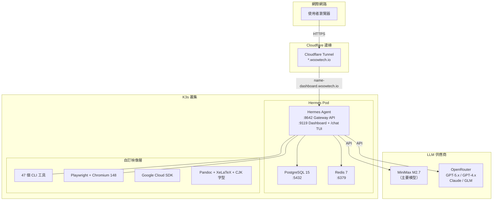
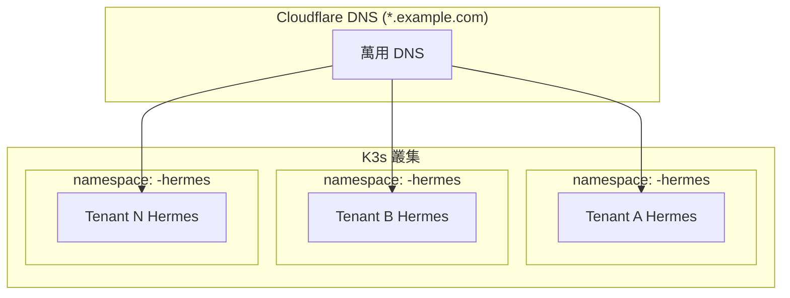
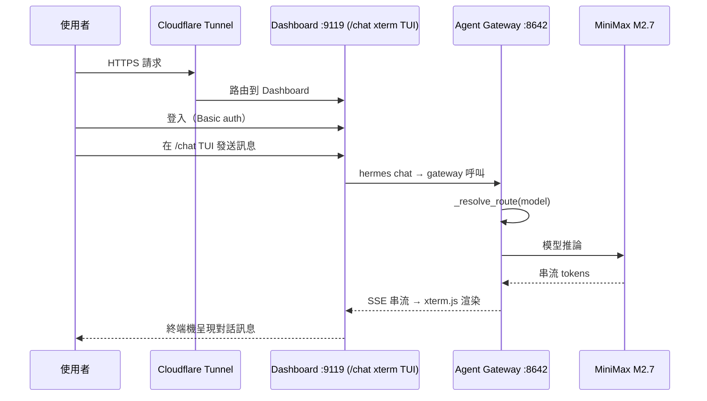
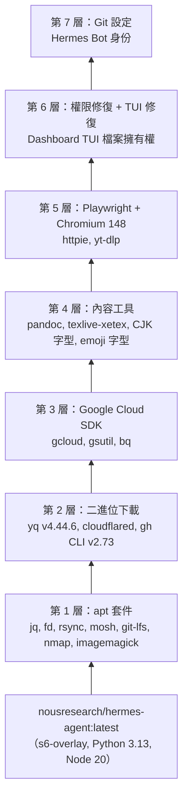
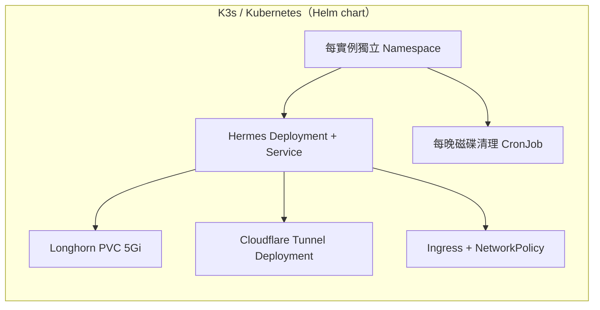

<div align="center">
  

  <h1>WoowTech Hermes Agent</h1>
  <p><strong>企業級 AI 智慧助手 — 雙介面、47 個 CLI 工具、93 個技能、多實例白標部署</strong></p>

  <p>
    
    
    
    
    
    
    
  </p>

  <p>
    <a href="README.md">English</a> |
    <a href="README_zh-TW.md">繁體中文</a>
  </p>
</div>

> [!IMPORTANT]
> **本 repository 以 Helm chart 方式打包 Hermes Agent，適用於 K3s / Kubernetes。**
>
> 如需單機 Podman 部署，請前往姊妹 repository：[**WOOWTECH/Woow_podman_hermes**](https://github.com/WOOWTECH/Woow_podman_hermes)。

---

## 目錄

- [總覽](#總覽)
- [核心功能](#核心功能)
- [系統架構](#系統架構)
- [系統元件](#系統元件)
- [截圖展示](#截圖展示)
- [部署方式](#部署方式)
- [自訂 Docker 映像](#自訂-docker-映像)
- [多實例部署](#多實例部署)
- [白標品牌](#白標品牌)
- [CLI 工具參考](#cli-工具參考)
- [技能目錄](#技能目錄)
- [API 參考](#api-參考)
- [測試](#測試)
- [安全性](#安全性)
- [疑難排解](#疑難排解)
- [更新日誌](#更新日誌)
- [支援與授權](#支援與授權)

---

## 總覽

**WoowTech Hermes Agent** 是基於 [Nous Research Hermes Agent](https://github.com/NousResearch/hermes-agent) 打造的企業級自建 AI 助手平台。提供完整的 AI 工作空間：單一 Dashboard TUI 對話介面（xterm.js 的 `hermes chat` REPL，跑在 agent 容器內）、47 個預裝 CLI 工具、93 個 AI 技能、多 LLM 支援，部署於 K3s Kubernetes、由 Cloudflare Tunnel 自動提供 HTTPS。

### 為什麼選擇 WoowTech Hermes？

| 挑戰 | WoowTech 方案 |
|------|--------------|
| SaaS AI 工具存在資料外洩風險 | **自建部署**，資料留在自己的基礎設施 |
| 通用 AI 助手缺乏領域知識 | **93 個領域技能**，包含 Odoo 18 ERP、ESG/WELL/LEED、金融 |
| 單一模型綁定 | **多 LLM 支援**：MiniMax M2.7 主要模型 + OpenAI/Claude/GLM via OpenRouter |
| 無瀏覽器自動化能力 | **Playwright + Chromium 148** 內建於 Agent 容器 |
| Kubernetes 部署複雜 | **一鍵部署** `helm install` + 黃金配置 |
| 僅支援單租戶 | **多實例隔離**，命名空間隔離 + 每租戶獨立品牌 |

---

## 核心功能

| 功能 | 說明 |
|------|------|
| **Dashboard + TUI 對話** | Dashboard (:9119) 提供 150+ 設定，並在 `/chat` 內建 xterm.js 的 `hermes chat` REPL（跑在 agent 容器內） |
| **47 個 CLI 工具** | curl, git, jq, yq, rg, fd, gcloud, gh, pandoc, ffmpeg, yt-dlp, nmap 等 |
| **93 個 AI 技能** | 19 類別：軟體開發、創意設計、MLOps、Odoo ERP、學術研究、媒體 |
| **多 LLM 支援** | MiniMax M2.7（主要）, GPT-5.x/4.x via OpenRouter, Claude, GLM |
| **模型路由** | Gateway `model_routes` 支援 `@openai:` 和 `@openai-api:` 前綴 |
| **Playwright + Chromium** | 內建瀏覽器自動化，支援截圖、表單填寫、E2E 測試 |
| **持久化記憶** | SOUL.md（身份）、USER.md（偏好）、MEMORY.md（學習上下文） |
| **看板 + 任務** | 專案看板、待辦清單、排程任務管理 |
| **數據分析** | Token 用量、模型分布、費用追蹤 |
| **Gateway API** | OpenAI 相容 REST API，端口 8642 |
| **白標品牌** | 每實例自訂 Logo、顏色、標題 |
| **Cloudflare Tunnel** | 自動 HTTPS，無需端口轉發或憑證 |

---

## 系統架構

### 系統架構圖



### 多實例架構



### 請求流程



### Docker 映像層結構



### K3s 資源總覽



> Podman 單機部署位於姊妹 repository [WOOWTECH/Woow_podman_hermes](https://github.com/WOOWTECH/Woow_podman_hermes)。

---

## 系統元件

| 元件 | 映像 | 端口 | 用途 | Chart 模板 |
|------|------|------|------|-----------|
| **Hermes Agent** | `nousresearch/hermes-agent:latest` | 8642（Gateway）, 9119（Dashboard + /chat TUI） | AI 引擎、工具執行、Gateway API、Dashboard + xterm.js 對話 TUI | `templates/hermes-deployment.yaml` |
| **瀏覽器終端** | `ubuntu:24.04` + ttyd 1.7.7 | 7681 | 瀏覽器 TUI — kubectl exec 進入 hermes-agent shell | `templates/terminal.yaml` |
| **PostgreSQL** | `postgres:15` | 5432 | 資料持久化（對話、記憶、設定） | `templates/postgresql-deployment.yaml` |
| **Redis** | `redis:7-alpine` | 6379 | 快取、Session 狀態 | `templates/redis-deployment.yaml` |
| **Cloudflared** | `cloudflare/cloudflared:latest` | — | Cloudflare Tunnel，提供 HTTPS 存取 | `templates/cloudflared.yaml` |

### Chart 目錄結構

```
.
├── Chart.yaml                              # apiVersion v2、name: hermes
├── values.yaml                             # 所有預設值與各元件開關
├── .helmignore
└── templates/
    ├── namespace.yaml                      # 由 namespace.create 控制
    ├── rbac.yaml                           # SA + ClusterRole + Role
    ├── configmap.yaml                      # cf-config + hermes-config + toolset 覆寫
    ├── secret.yaml                         # hermes-secrets + cf-secrets（stringData）
    ├── pvc.yaml                            # 3 個 PVC（agent / postgres / redis）
    ├── postgresql-deployment.yaml          # postgresql.enabled
    ├── redis-deployment.yaml               # redis.enabled
    ├── hermes-deployment.yaml              # Agent Deployment + Service（Gateway + Dashboard）
    ├── cloudflared.yaml                    # cloudflared.enabled
    ├── ingress.yaml                        # cloudflare.ingress.enabled
    ├── network-policy.yaml                 # networkPolicy.enabled
    ├── terminal.yaml                       # terminal.enabled（ttyd + SA/Role/RoleBinding）
    └── disk-cleanup-cronjob.yaml           # diskCleanup.enabled（每晚執行）
```

---

## 服務 URL

WoowTech Hermes 透過 Cloudflare Tunnel 對外暴露兩個服務：

| 服務 | URL | 端口 | 用途 |
|------|-----|------|------|
| **Dashboard**（管理 + 對話 TUI） | `https://<PREFIX>-dashboard.woowtech.io` | 9119 | Agent 管理（設定、MCP、模型、日誌、系統）+ `/chat` 內建 xterm.js 的 `hermes chat` REPL |
| **Terminal**（終端） | `https://<PREFIX>-hermes-terminal.woowtech.io` | 7681 | 瀏覽器 bash shell，直接操作 hermes-agent 容器 |

---

## MCP 整合

Hermes 支援連接遠端 [Model Context Protocol (MCP)](https://modelcontextprotocol.io/) 伺服器，擴展工具能力。

### 已設定的 MCP Server

| Server | URL | 認證方式 | 狀態 |
|--------|-----|---------|------|
| Higgsfield | `https://mcp.higgsfield.ai/mcp` | OAuth 2.1 + PKCE | Dashboard 授權 |
| Browserless | `https://mcp.browserless.io/mcp` | Bearer Token | API key |
| Cloudflare | `https://mcp.cloudflare.com/mcp` | OAuth 2.1 + PKCE | Dashboard 授權 |
| WoowTech Odoo | `https://woowtech-mcp-odoo.woowtech.io/...` | URL Token | 自動連接 |

### Dashboard MCP OAuth 認證

需要 OAuth 的 MCP Server 可直接從 Dashboard 完成認證：

1. 前往 **Dashboard → MCP** 頁面
2. 點擊 **🔑 Authenticate**
3. 在彈出視窗完成 OAuth 登入
4. Token 自動儲存並定期刷新

**必要設定：**
- `HERMES_DASHBOARD_PUBLIC_URL` 需指向 Dashboard 的公開 URL

---

## 瀏覽器終端（ttyd）

提供瀏覽器直接存取 hermes-agent 容器的 bash shell，與 Agent 在相同的環境中操作。

### 架構

```
瀏覽器 → Cloudflare Tunnel → ttyd Pod (:7681) → connect.sh → kubectl exec → hermes-agent bash
```

### 存取方式

```
URL:  https://<PREFIX>-hermes-terminal.woowtech.io
認證: HTTP Basic Auth（admin / 設定的密碼）
```

### 終端中可用的工具

- `hermes` CLI（version、config、mcp list/login 等）
- 全部 47 個預裝 CLI 工具
- Python 3.13 + pip
- 直接存取 `/opt/data/config.yaml` 和 `.hermes/` 狀態目錄

---

## 截圖展示

### 登入頁面


> 純密碼登入 — 無需帳號，適合團隊快速共享存取。

### 對話介面


> 完整功能的對話介面，支援 Markdown 渲染、程式碼高亮、串流回應。

### AI 回應


> AI 回應支援程式碼區塊、表格、Markdown 格式化、工具呼叫結果。

### 模型選擇器


> 即時切換 MiniMax M2.7、GPT-5.x、GPT-4.x 等多種模型。

### 技能目錄


> 93 個預載 AI 技能，涵蓋軟體開發、Odoo ERP 等 19 個類別。

### 記憶管理


> 持久化記憶系統：SOUL.md（身份）、USER.md（偏好）、MEMORY.md（學習上下文）。

### 數據分析


> 追蹤 Token 用量、模型分布、對話指標、費用分析。

### 看板


> 內建看板，用於專案管理與任務追蹤。

### 任務與排程


> 使用 Cron 表達式排程定期任務，監控執行歷史。

### Dashboard（150+ 設定）


> 完整控制 Agent 行為、LLM 設定、MCP 伺服器、工具集等。

### 行動裝置響應式


> 完全響應式設計，手機和平板皆可使用。

---

## 部署方式

### 前置條件

- K3s（或任何 Kubernetes 1.24+）叢集，且可用 `kubectl`
- Helm 3.x
- Longhorn 儲存類別給 agent PVC 使用（或以 `hermes.persistence.storageClassName` 覆寫）
- `local-path`（或任何 RWO 類別）供 PostgreSQL 和 Redis 使用
- Cloudflare 帳號與 Tunnel token（若要使用內建 HTTPS ingress）

### 快速開始（Helm）

一個 Helm release 對應一個 Hermes 實例：`instance` 決定該 release 底下每個物件的名稱
（`hermes`、`hermes-postgresql`、...），所以多個 release 只要 `instance` 不同就能共用同一個
namespace。預設情況下 Secret **只會被引用、不會被這個 chart 產生** —— 請先自行建立好，
key 清單見 `examples/secrets.example.yaml`。

```bash
# 1. 複製本倉庫（或使用 GitHub release 的 tarball）
git clone https://github.com/WOOWTECH/Woow_k3s_hermes.git
cd Woow_k3s_hermes

# 2. 建立這個實例需要的 Secret（完整 key 清單見 examples/secrets.example.yaml）
#    絕對不要把填好真實值的檔案提交進 git。
kubectl create namespace hermes
kubectl -n hermes create secret generic hermes-secrets \
  --from-literal=API_SERVER_KEY="$(openssl rand -hex 24)" \
  --from-literal=MINIMAX_API_KEY="<your-minimax-key>" \
  --from-literal=POSTGRES_PASSWORD="$(openssl rand -hex 16)" \
  --from-literal=TTYD_PASSWORD="$(openssl rand -hex 16)"
# 只有在 cloudflared.enabled（預設開啟）時才需要：
kubectl -n hermes create secret generic cf-secrets \
  --from-literal=CF_API_TOKEN="<cloudflare-api-token>" \
  --from-literal=CF_TUNNEL_TOKEN="<cloudflare-tunnel-token>"

# 3. 建立 values override —— 實例名稱與這個實例專屬的設定。
#    不要在裡面寫 `namespace:`：物件位置跟著 `-n` 走，寫死的 namespace
#    會蓋掉 `-n`、把東西寫到你沒打算寫的地方。
cat > my-values.yaml <<'EOF'
instance: hermes
EOF

# 4. 安裝。網域與 Dashboard 密碼是佔位字，必須在這裡帶入，不要寫進 values 檔。
helm install hermes . -n hermes -f my-values.yaml \
  --set-string placeholders.DOMAIN=hermes.example.com \
  --set-string placeholders.DASHBOARD_PASSWORD="$DASHPASS"

# 5. 觀察啟動狀態並驗證
kubectl -n hermes get pods -w
helm test hermes -n hermes
```

若要接手既有、手動管理的實例而非全新安裝，見 `deploy/woow-k3s/` 底下的各實例 values
檔，並在 `helm upgrade --install` 加上 `--take-ownership`——詳見下方
[多實例部署](#多實例部署)。

### 功能開關（`values.yaml`）

每個元件都以 `enabled` 開關獨立控制，開發叢集可以只保留最小組合，正式環境則可全部開啟。

| 開關 | 預設 | 產出內容 |
|------|------|----------|
| `namespace.create` | `true` | `Namespace` 物件本身（若等於 `-n` 指定的 release namespace 則不輸出）。 |
| `secrets.create` | `false` | 從 values 產生 `<instance>-secrets` 與 `cf-secrets`（有 `required()` 把關）。預設關閉——Secret 是被引用而非由 chart 擁有。 |
| `postgresql.enabled` | `true` | Postgres Deployment + Service + PVC。 |
| `redis.enabled` | `true` | Redis Deployment + Service + PVC。 |
| `cloudflared.enabled` | `true` | Cloudflare Tunnel Deployment（需要 `cf-secrets`）。不隨 instance 命名——一個 namespace 最多一條 tunnel，同一 namespace 的第二個實例必須關閉此項。 |
| `cloudflare.ingress.enabled` | `true` | 將 `<domain>/api` 導向 gateway 的 `<instance>-ingress`。 |
| `terminal.enabled` | `true` | ttyd 瀏覽器終端（SA/Role/RoleBinding + Deployment + Service），命名為 `<instance>-terminal*`。 |
| `diskCleanup.enabled` | `true` | 每晚清理 agent PVC 上 journal 與 dump 檔的 `<instance>-disk-cleanup` CronJob。 |
| `networkPolicy.enabled` | `true` | `<instance>-postgresql-policy` / `<instance>-redis-policy`，限制只有 agent pod 能連線資料庫。 |
| `rbac.enabled` | `false` | 給 agent ServiceAccount 的叢集唯讀 + 命名空間讀寫 RBAC。預設關閉：目前三個正式實例都沒有掛這組權限。 |
| `hermes.service.nodePort` / `dashboardNodePort` | `null` | 只在 `hermes.service.type: NodePort` 時才輸出。 |
| `tests.enabled` | `true` | `helm test` 煙霧測試 Pod（對本 release 自己的 Service 做 TCP 檢查）。 |
| `networkPolicy.allowTests` | `true` | 放行 `helm test` 煙霧測試 Pod 連到 Postgres/Redis。不開的話 NetworkPolicy 會擋住測試，`helm test` 永遠不會通過。若某個實例的正式 NetworkPolicy 必須在接手時保持逐位元組相同，就設為 `false`。 |
| `placeholdersStrict` | `true` | 任何 `__NAME__` 佔位字沒被取代時直接讓 render 失敗（見 [Placeholders](#placeholders寫死在-pod-template-裡的憑證)）。 |

### 套用前預覽 / diff

```bash
helm lint . -f my-values.yaml --set-string placeholders.DOMAIN=x,placeholders.DASHBOARD_PASSWORD=x
helm template hermes . -n hermes -f my-values.yaml \
  --set-string placeholders.DOMAIN=x,placeholders.DASHBOARD_PASSWORD=x | less
helm diff upgrade hermes . -n hermes -f my-values.yaml   # 如已安裝 helm-diff plugin
```

### 黃金配置（`config/golden-config.yaml`）

黃金配置是 Hermes Agent 的核心配置檔（630+ 行），主要區段：

| 區段 | 設定項 | 說明 |
|------|--------|------|
| `platforms.api_server` | 28 條模型路由、CORS、API 金鑰 | Gateway API 配置 |
| `llm` | model, provider, temperature, max_tokens | LLM 推論設定 |
| `mcp.servers` | Playwright, filesystem, fetch | MCP 伺服器配置 |
| `agent` | approval_mode, tools, skills | Agent 行為設定 |
| `dashboard` | auth, TUI, themes, plugins | Dashboard 配置 |

### 模型路由

Gateway 透過 `model_routes` 將模型別名路由到 LLM 供應商：

```yaml
model_routes:
  "@openai:gpt-5.4-mini":
    model: openai/gpt-5.4-mini
    base_url: https://openrouter.ai/api/v1
    api_key: __OPENROUTER_API_KEY__
  "@openai-api:gpt-5.4-mini":   # OpenAI 相容客戶端選擇器格式
    model: openai/gpt-5.4-mini
    base_url: https://openrouter.ai/api/v1
    api_key: __OPENROUTER_API_KEY__
```

**支援模型**（11 個模型 x 2 前綴 = 22 條路由）：
gpt-5.5, gpt-5.5-pro, gpt-5.4, gpt-5.4-mini, gpt-5.4-nano, gpt-5-mini, gpt-5.3-codex, gpt-5.2-codex, gpt-4.1, gpt-4o, gpt-4o-mini

### 環境變數

| 變數 | 必填 | 說明 |
|------|------|------|
| `MINIMAX_API_KEY` | 是 | MiniMax M2.7 API 金鑰 |
| `OPENROUTER_API_KEY` | 是 | OpenRouter API 金鑰（用於 GPT/Claude） |
| `API_SERVER_KEY` | 是 | Gateway API 認證金鑰 |
| `DASHBOARD_PASSWORD` | 是 | Dashboard Basic-auth 密碼 |
| `CLOUDFLARE_TUNNEL_TOKEN` | K3s 專用 | Cloudflare Tunnel Token |
| `POSTGRES_PASSWORD` | 是 | PostgreSQL 密碼 |

---

## 自訂 Docker 映像

自訂 Dockerfile（`docker/Dockerfile.hermes-agent`）在基礎映像上增加 7 層：

```bash
# 建置自訂映像
cd docker
docker build -t hermes-agent-custom:latest -f Dockerfile.hermes-agent .

# 推送到 Registry
docker tag hermes-agent-custom:latest <registry>/hermes-agent-custom:latest
docker push <registry>/hermes-agent-custom:latest
```

### 相較基礎映像新增的內容

| 層 | 套件 | 大小影響 |
|-----|------|---------|
| 核心 apt | jq, fd, rsync, mosh, git-lfs, imagemagick, nmap, dnsutils | ~50MB |
| 二進位 | yq v4.44.6, cloudflared, gh CLI v2.73 | ~80MB |
| Google Cloud | gcloud, gsutil, bq | ~200MB |
| 內容工具 | pandoc, texlive-xetex, CJK 字型, emoji 字型 | ~300MB |
| Playwright | Chromium 148, httpie, yt-dlp | ~400MB |
| 清理 | 權限修復、TUI 擁有權 | ~0MB |
| Git 設定 | Hermes Bot 身份 | ~0MB |

---

## 多實例部署

**一個 Helm release 對應一個 Hermes 實例。** 物件名稱（`<instance>`、
`<instance>-postgresql`、`<instance>-postgresql-svc` ...）是由 `instance`
這個值決定，而不是 release 名稱或 namespace——所以多個 release 只要
`instance` 不同，就能共用同一個 namespace 而不會互相碰撞。（唯一以
namespace 為單位、不隨 instance 命名的例外是 `cloudflared`／
`cf-secrets`：一個 namespace 最多只有一條 Cloudflare Tunnel，不論裡面
住了幾個 Hermes 實例——同一 namespace 的第二個實例必須把
`cloudflared.enabled` 設為 `false`。）

### 部署全新實例

```bash
helm install hermes-tenant-a . -n tenant-a-hermes --create-namespace \
  --set instance=hermes -f tenant-a-values.yaml

helm install hermes-tenant-b . -n tenant-a-hermes \
  --set instance=tenant-b -f tenant-b-values.yaml   # 共用 tenant-a-hermes 的 namespace
```

每個 values 檔要分別設定自己的 `instance`，若是共用 namespace 的第二個實例
還要加上 `cloudflared.enabled: false`。**不要**在 values 檔裡寫
`namespace:`——物件位置是跟著 `-n` 走的，寫死的 namespace 會蓋掉 `-n`、
把東西寫到你沒打算寫的地方。網域與 Dashboard 密碼請用
`--set-string placeholders.DOMAIN=... --set-string placeholders.DASHBOARD_PASSWORD=...`
在套用當下帶入。

### 接手既有、手動管理的實例

`deploy/woow-k3s/<namespace>-<instance>.yaml` 重現了本倉庫三個正式實例其中
一個的完整設定（不含機密——那些已經以 Secret 形式存在叢集裡）：

| 檔案 | Namespace | Instance | 備註 |
|------|-----------|----------|------|
| `deploy/woow-k3s/hermes-hermes.yaml` | `hermes` | `hermes` | 完整組合：postgres、redis、cloudflared、terminal、disk-cleanup、ingress。 |
| `deploy/woow-k3s/eugenechen-hermes-hermes.yaml` | `eugenechen-hermes` | `hermes` | 已停用（`replicaCount: 0`）的舊版雙容器 agent+webui pod。 |
| `deploy/woow-k3s/cindytech-cindytech1.yaml` | `cindytech` | `cindytech1` | 與客戶另一套 Odoo/n8n 共用 namespace；`cloudflared` 保持關閉——那條 tunnel 屬於 Odoo。 |

```bash
helm upgrade --install hermes . -n hermes \
  -f deploy/woow-k3s/hermes-hermes.yaml --take-ownership \
  --set-string placeholders.DASHBOARD_PASSWORD="$DASHPASS"
```

套用 `deploy/woow-k3s/*.yaml` 會逐欄位重現正式環境現有的物件圖（可用
`scripts/check-drift.sh` 驗證），所以 `--take-ownership` 只是接手既有物件，
不會讓任何東西重新啟動。

### Placeholders：寫死在 pod template 裡的憑證

有幾個正式環境物件把憑證直接以**明文寫在 pod template 裡**，而不是引用
Secret——Dashboard 的 basic-auth 密碼、舊版 webui 密碼、以字面值設定的
Postgres 密碼、以 `--token` 參數傳入的 Cloudflare tunnel token。這裡有兩條
規則會互相衝突：這種值絕對不能提交進 git，但接手時 pod template 又必須逐
位元組相同，否則每個 pod 都會重啟。

因此提交進 git 的值裡放的是 `__NAME__` 佔位字，真實值在套用當下才帶入
（直接管線傳入，絕對不要寫成檔案）：

```bash
--set-string placeholders.DASHBOARD_PASSWORD="$DASHPASS"
```

| 佔位字 | 使用者 |
|--------|--------|
| `DOMAIN` | chart 預設值裡的 `hermes.config.HERMES_DOMAIN` / `HERMES_BASE_URL` 與 Ingress host |
| `DASHBOARD_PASSWORD` | `hermes.dashboardAuth.password`（所有開啟 Dashboard 的實例） |
| `WEBUI_PASSWORD` | 舊版 `hermes-webui` sidecar（`eugenechen-hermes`、`cindytech1`） |
| `POSTGRES_PASSWORD` | `eugenechen-hermes`，它的 Postgres 密碼是明文環境變數 |
| `MINIMAX_API_KEY` | `eugenechen-hermes`，它的 webui sidecar 把 key 寫死在 `args` 裡 |
| `CF_TUNNEL_TOKEN` | `eugenechen-hermes`，它的 tunnel 以 CLI 參數帶 token |

`placeholdersStrict`（預設 `true`）會在任何 `__NAME__` 沒被取代時直接讓
render 失敗，所以接手時不可能默默把字面上的 `__DASHBOARD_PASSWORD__` 當成
某人的密碼送上去——那同時也會改到 pod template、害 pod 重啟。每個實例檔案
的開頭都列出它需要哪些佔位字。

`__INSTANCE__` 是內建佔位字，永遠會被換成 `instance`。chart 預設值就是靠它
來命名這個 release 自己的物件（`__INSTANCE__-secrets`、`__INSTANCE__-config`、
`__INSTANCE__-postgresql-svc`），而不是寫死某一個實例的名字。

---

## CLI 工具參考

自訂 Docker 映像包含 **47 個 CLI 工具**，涵蓋 6 大類別：

| 類別 | 數量 | 工具列表 |
|------|------|---------|
| **網路與連線** | 15 | curl, http, lynx, ssh, scp, sftp, ssh-keygen, rsync, mosh, dig, nslookup, ping, traceroute, nmap, nc |
| **開發與搜尋** | 13 | git, git-lfs, jq, yq, rg, fd, python3, pip, uv, uvx, node, npm, npx |
| **雲端與 DevOps** | 7 | gcloud, gsutil, bq, gh, cloudflared, helm*, argocd* |
| **資料庫** | 1 | redis-cli |
| **文件與媒體** | 5 | pandoc, xelatex, convert (ImageMagick), ffmpeg, yt-dlp |
| **瀏覽器自動化** | 2 | playwright (Python 1.60), chromium (148) |

> *helm 和 argocd 已從自訂映像中移除以節省空間（容器內無對應服務）。

---

## 技能目錄

**93 個 AI 技能**，涵蓋 **19 個類別**：

| 類別 | 數量 | 代表技能 |
|------|------|---------|
| software-development | 12 | TDD、systematic-debugging、writing-plans、code-review |
| creative | 20 | p5js、manim-video、sketch、pixel-art、design |
| mlops | 9 | huggingface-hub、vllm、weights-and-biases |
| productivity | 9 | notion、google-workspace、airtable、linear |
| odoo-18-erp | 8 | odoo-sales-crm、odoo-accounting、odoo-inventory-mrp |
| github | 6 | github-pr-workflow、github-code-review |
| research | 5 | arxiv、research-paper-writing、polymarket |
| media | 5 | spotify、youtube-content、gif-search |
| autonomous-ai-agents | 5 | claude-code、codex、hermes-agent |
| 其他（10 類） | 14 | apple-notes、openhue、native-mcp 等 |

---

## API 參考

Hermes 於 Dashboard 服務提供 **28 個已驗證 API 端點**：

### Dashboard API（端口 9119）— 28 個端點

| 端點 | 方法 | 說明 |
|------|------|------|
| `/api/status` | GET | Gateway 狀態與健康檢查 |
| `/api/config` | GET | 150+ 配置欄位 |
| `/api/sessions` | GET | 活躍 Session 列表 |
| `/api/skills` | GET | 技能目錄 |
| `/api/cron/jobs` | GET | 排程任務 |
| `/api/memory` | GET | 記憶資料（SOUL/USER/MEMORY） |
| `/api/model/info` | GET | 當前模型資訊 |
| `/api/model/options` | GET | 可用模型列表 |
| `/api/analytics/usage` | GET | Token 用量統計 |
| `/api/logs` | GET | Agent 日誌 |

完整 API 文件：[docs/api-contract.md](docs/api-contract.md)

---

## 測試

### 7 輪企業級測試套件

```bash
cd tests
bash run-all.sh
```

| 輪次 | 焦點 | 測試內容 |
|------|------|---------|
| 第 1 輪 | 基礎設施 | Pod 健康、PVC、DNS、端口連通性 |
| 第 2 輪 | API | 所有 28 個 Dashboard 端點驗證 |
| 第 3 輪 | 安全性 | 認證、CORS、速率限制、密鑰遮蔽 |
| 第 4 輪 | 韌性 | Pod 重啟、PVC 持久化、當機復原 |
| 第 5 輪 | 整合 | Dashboard TUI ↔ Gateway ↔ LLM 端到端 |
| 第 6 輪 | LLM 整合 | 模型路由、回應品質、串流 |
| 第 7 輪 | Dashboard 功能 | 對話 TUI、技能、記憶、看板、數據分析 |

### Playwright E2E 測試

```bash
cd tests/playwright
npx playwright test
```

測試涵蓋：登入流程、發送/接收對話、模型選擇器、技能頁面、記憶頁面。

### 影片 Pipeline E2E 測試

針對 [0.16.2] 新增的簡報轉影片流水線設計的兩個對抗性測試。腳本完全跑在
hermes-agent 容器內、素材當場產生、任一失敗即 exit non-zero —— CI 友好。

```bash
# 在 hermes-agent pod 內執行（依賴需已安裝，見 0.16.2 更新日誌）
kubectl -n hermes cp tests/video-e2e-happy.sh <pod>:/tmp/vhap.sh -c hermes-agent
kubectl -n hermes cp tests/video-e2e-edges.sh <pod>:/tmp/vedg.sh -c hermes-agent
kubectl -n hermes exec <pod> -c hermes-agent -- bash /tmp/vhap.sh
kubectl -n hermes exec <pod> -c hermes-agent -- bash /tmp/vedg.sh
```

| 套件 | 涵蓋內容 | 時間 |
|------|---------|------|
| **video-e2e-happy.sh** | 完整快樂路徑：3 頁 HTML → edge-tts 英文旁白 ×2 → Playwright headless 錄 WebM (1280×720) → ffmpeg 音訊對齊 segment → concat demuxer → srt+pysubs2 字幕來回驗證 → ffmpeg 燒錄字幕 → ffprobe 品質關卡（h264+aac、解析度、大小、時長） | ~60-90 秒 |
| **video-e2e-edges.sh** | 10 個對抗性邊緣：空 TTS 輸入、60+秒長段旁白、emoji/中文/URL/引號、0.3 秒微型錄影、1920×1080 滾動錄影、混合解析度 concat、字元刁鑽 SRT 來回、字幕含特殊字元燒錄、rclone 無 config dry-run、Playwright 雙並行 context | ~90-120 秒 |

已在 woow-k3s 生產叢集驗證：快樂路徑 6/6 + 邊緣 10/10 = **16/16 全通過**（詳見 [CHANGELOG.md](CHANGELOG.md) [0.16.2]）。

**pipeline 跑在哪裡？** 全部跑在 **hermes-agent** 容器內，透過 **Dashboard TUI（Port 9119 · `https://<dashboard-host>/chat` · xterm.js 的 `hermes chat` REPL）** 呼叫。這個容器藉由 Dockerfile 與 video-pipeline 安裝腳本已預裝 ffmpeg / edge-tts / rclone / playwright。`tests/video-tui-t2-pipeline.sh` 是「一行呼叫」參考範本（agent 只需 `bash /opt/data/t2_full_pipeline.sh` 就跑完整條）。有關為什麼現在只有一個對話介面，請參閱 [docs/migration/2026-07-30-webui-removal.md](docs/migration/2026-07-30-webui-removal.md)。

完整測試文件：
- [tests/PRD-hermes-enterprise-test.md](tests/PRD-hermes-enterprise-test.md) — 測試需求
- [tests/TEST-REPORT-enterprise.md](tests/TEST-REPORT-enterprise.md) — 測試結果

---

## 安全性

| 措施 | 實作方式 |
|------|---------|
| **加密** | 所有流量經由 Cloudflare Tunnel（TLS 1.3） |
| **認證** | 純密碼登入（簡單共享存取） |
| **網路隔離** | K8s NetworkPolicy 限制 Pod 間流量 |
| **RBAC** | K8s ServiceAccount 最小權限 |
| **密鑰管理** | K8s Secrets 存放 API 金鑰（不放 ConfigMap） |
| **API 金鑰遮蔽** | Dashboard `/api/env` 遮蔽敏感值 |
| **審核模式** | `manual`（需確認）或 `yolo`（自動化） |
| **工具限制** | `tirith_enabled: false` 提供操作靈活性 |

---

## 疑難排解

| 問題 | 原因 | 解決方案 |
|------|------|---------|
| Dashboard TUI 空白 | 權限不符 | Dockerfile 第 7 層已修復，重建自訂映像 |
| Dashboard 頁面載入後空白 | Vite entry-chunk 被改名 | 詳見 `docs/troubleshooting.md §1` — `patches/mcp_patch.py` 已改為原地編輯，不再改名 |
| 模型回傳 MiniMax 而非 GPT | 缺少 `@openai-api:` 路由 | 執行 `config/fix-model-routes.py` 新增路由 |
| Cloudflare Tunnel 離線 | Token 過期或 Tunnel 被刪除 | 在 values 檔更新 `CF_TUNNEL_TOKEN` 後執行 `helm upgrade` |
| PVC 滿了（5Gi） | 舊對話累積 | 透過 Dashboard Settings 封存/刪除舊 Session |
| Playwright 失敗 | Chromium 未安裝 | 確保使用自訂 Docker 映像（非基礎映像） |
| `.env` 更新後未同步 | 指紋不符 | 執行 `config/apply-env-fingerprint-patch.py` |

---

## 更新日誌

### v0.15（2026-07）
- 模型路由修復：新增 `@openai-api:*` 路由以相容 OpenAI 相容客戶端選擇器
- 同步模型列表（新增 gpt-5.5-pro、gpt-5.4-nano）
- K3s/Podman `.env` 指紋同步修補
- Playwright E2E 測試套件（10/10 通過）

### v0.14（2026-06）
- 多實例部署改用逐 namespace 的 `helm install`
- 白標品牌系統（WoowTech + Apporo）
- 黃金配置/設定模板

### v0.13（2026-05）
- 自訂 Docker 映像（47 CLI 工具 + Playwright）
- 7 輪企業級測試套件
- API 合約文件（46 端點）
- Podman compose 部署選項

---

## 支援與授權

**維護團隊**：WOOW Tech 沃科技

- GitHub Issues：[WOOWTECH/Woow_k3s_hermes/issues](https://github.com/WOOWTECH/Woow_k3s_hermes/issues)
- 上游專案：[Nous Research Hermes Agent](https://github.com/NousResearch/hermes-agent)
- 使用手冊：[docs/user-manual-zh-TW.md](docs/user-manual-zh-TW.md)（25 章完整中文手冊）

**授權**：Proprietary — WOOW Tech 部署與客製化層。上游元件保留各自授權。
